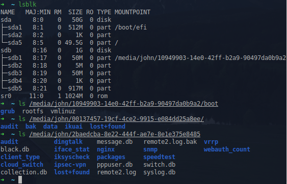
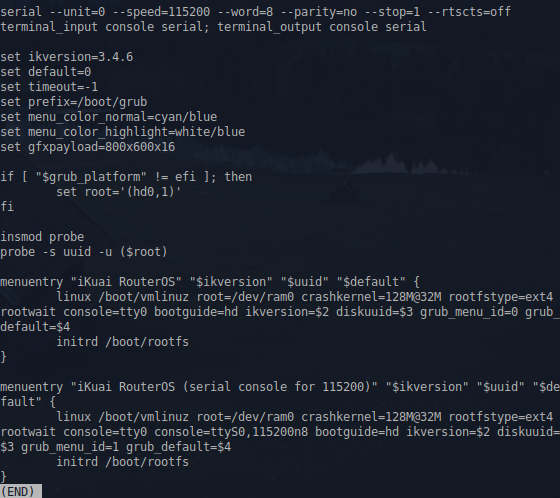
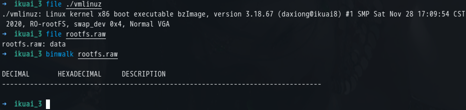
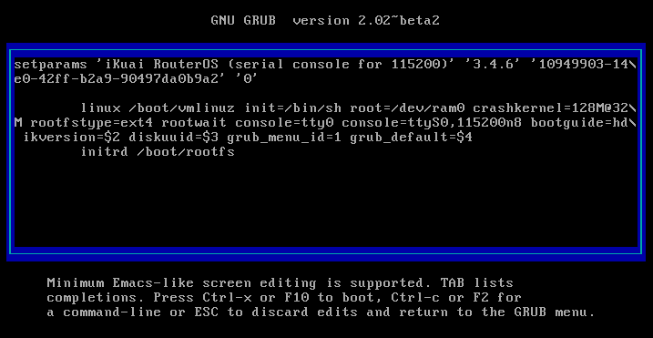
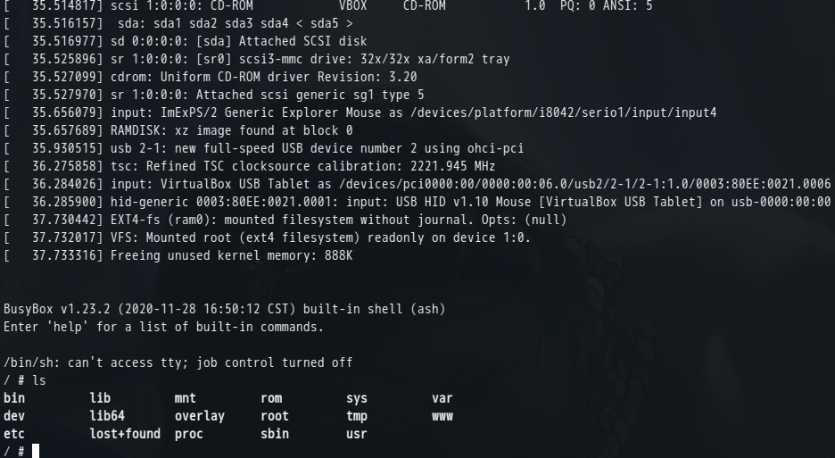
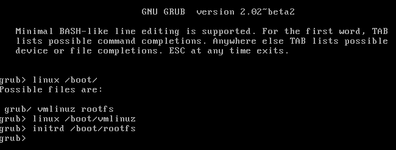
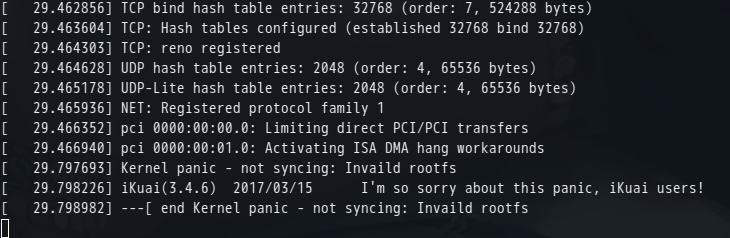
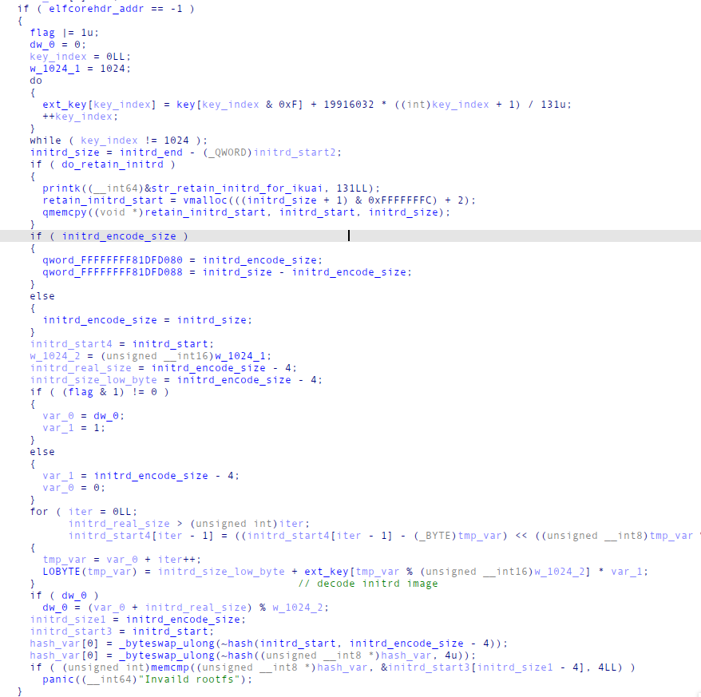
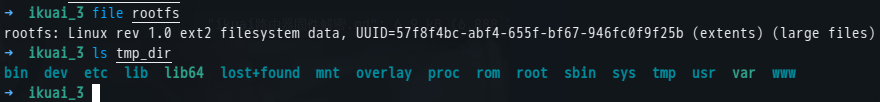

## ikuai简介

ikuai是国内一家提供商业组网解决方案的厂家，硬件产品主要有交换机、路由、网桥、室内外AP等，软件产品主要是ikuai软路由系统及ikuai云。ikuai产品在小型企业、学校、写字楼、商场、酒店、医院、商业休闲场所有广泛的应用。

因为想看一下这个在社会上应用广泛的厂家的产品的安全性做的怎么样，遂有此文。

## 固件分析

在进行此次分析时ikuai软路由系统的最新版本为3.4.6,官网提供来ikuai软路由系统ISO、IMG、GHOST、BIN四种镜像，且主要支持x86架构。这里直接从官网下载ISO镜像，并在virtualbox虚拟机中进行安装。安装成功后将ikuai路由器系统的磁盘挂载到其他的linux系统上（这里使用ubuntu系统），可以看到ikuai系统的分区和分区内的文件



ikuai系统共有三个分区（一个启动分区、一个配置存储分区、一个数据存储分区），其中启动分区的boot文件夹内存储了内核文件vmlinuz，initrd文件rootfs，及grub的启动文件。grub.cfg文件如下：



grub.cfg中指定了内核启动的参数，`root=/dev/ram0` 说明ikuai系统使用了ramfs来作为系统的root目录文件系统，并把 `/boot/rootfs` 作为initrd直接加载到ramfs中。在第二个启动项中指定了串口ttyS0来打印终端信息，波特率为115200。这里为了可以在启动时临时编辑启动项，修改timeout设置为-1,让grub暂停在启动项选择页面上。



查看vmlinuz和rootfs的文件类型可以看到内核版本为3.18.67，打包为bzImage格式，编译人员是daxiong同学，编译时间是2020年11月28日。rootfs是一个数据文件，看不到文件格式信息，猜测厂商为了保护自己的知识产权，把rootfs给加密了。

打开虚拟机的串口配置，为虚拟机添加一个串口，在grub上选择第二个带有串口参数的启动项，按e键编辑启动项，在linux命令上增加 `init=/bin/sh` 参数：



在host机器上执行 `socat -d -d /tmp/serial PTY` 创建一个和虚拟机串口通信的串口设备文件 `/dev/pts/1`，`/tmp/serial` 为虚拟机串口配置中指定的本地socket文件。在另一个终端中执行 `minicom -b 115200 -D /dev/pts/1` 连接虚拟机的串口，虚拟机启动过程中的内核信息就通过串口打印到minicom中了。在minicom中查看虚拟机的内核启动信息及根文件系统结构：



在内核日志中的最后几行中可以看到RAMDISK文件系统的加载记录

```
RAMDISK: xz image found at block 0
EXT4-fs (ram0): mounted filesystem without journal. Opts: (null)
VFS: Mounted root (ext4 filesystem) readonly on device 1:0.
```

从这几条记录基本可以断定rootfs文件应该是一个xz压缩方式打包的ext4镜像文件。内核日志起始阶段还记录了kernel的参数和initrd的类型信息，感兴趣的可以自己查看。

根文件系统是一个正常linux的根文件系统结构，但是通过修改内核启动参数，替换init初始化程序的方式，无法进行正常的系统初始化，只能看到加载后的根文件系统的原始结构，无法查看系统正常运行状态的信息，甚至应用层运行最基本的环境也没有初始化，这并不是想要的结果。但是可以先浏览一下根文件系统中的文件，查看下系统配置，比较下和普通的linux发行版的初始化流程有什么差别。想要修改文件系统，查看系统运行状态，调试系统运行状态的二进制文件，依然需要解密rootfs文件。

## 固件解密

linux系统启动过程中有两处加载initrd的地方，第一处是grub中normal模式下通过initrd命令加载，第二处在linux内核中对initrd进行解压并加载到initrd_start全局变量指定的地址处。这里猜测厂家是在内核中做了手脚，而非在grub中，下面验证我的想法：

在ubuntu系统中随意编辑rootfs文件并保存，在ikuai系统的grub启动项选择界面按c键进入命令模式，按照grub.cfg中的内核参数手动键入加载指令，分别加载kernel和initrd，并未报告出错信息，文件正常加载了，返回启动项选择界面选择第二个启动项进入系统，在minicom中看到内核未正常启动并报告 `"Kernel panic - not syncing: Invaild rootfs"` ，猜测daxiong同学在内核中加了对rootfs文件的解密和校验流程。




搜索对应内核版本的源码发现没有 `"Invaild rootfs"` 字符串，猜测此字符串应该是daxiong同学添加的报错信息。使用内核源码的extract-vmlinux工具对[vmlinuz](vmlinuz)文件进行解包得到vmlinux可执行文件，此文件是静态链接的elf格式文件，放入IDA查看 `"Invaild rootfs"` 字符串的交叉引用定位到添加的解密部分在内核的populate_rootfs函数中：



逆向分析之后的解密流程如上图所示，使用c语言还原[解密算法](decode_rootfs.c)，对rootfs文件进行解密之后得到xz压缩格式的压缩文件，使用`xz -dk rootfs.xz`命令进行解包得到一个ext2文件系统镜像，使用ext2rd工具对镜像进行解包，得到和上面通过修改init进程看到的根文件系统结构相同的目录树:


至此固件解密完成。

## patch内核

得到解密后的rootfs文件之后，可以修改内部文件并使用 `xz -zk9 -C crc32 rootfs` 命令重新打包。重新打包后的rootfs使用原内核镜像加载同样过不了校验，因为解密代码对xz格式的文件又进行了一遍操作，并验证hash。对daxiong同学的解密算法进行逆运算得到加密算法重新加密rootfs显然不是一个明智的做法，况且不是所有的解密算法都可以逆运算推导出加密算法。简单的做法是对原内核进行[patch](vmlinux.patch)(由[bsdiff](http://www.daemonology.net/bsdiff/)工具生成），跳过解密流程，然后重新打包回bzImage格式。

重新编译一份3.18.67的内核，把编译之后的vmlinux替换为patch后的daxiong同学的vmlinux，然后运行 `make -o ./vmlinux bzImage` 命令重新打包[bzImage](bzImage.repacket)，将得到的bzImage文件(重命名为vmlinuz)和重打包后的rootfs.xz文件复制到ikuai系统启动分区的boot文件夹中，替换原始的vmlinuz和rootfs，重新引导系统，则成功进入系统。
