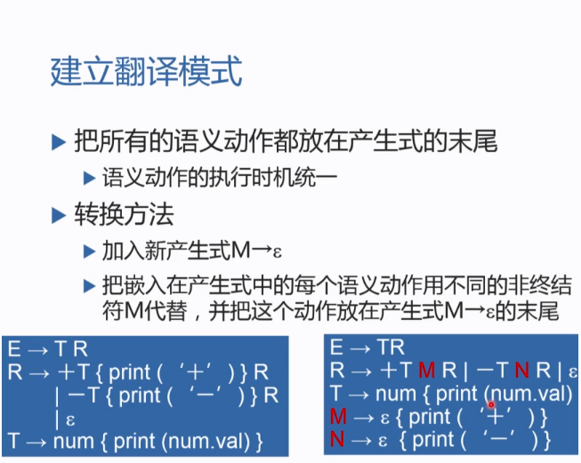
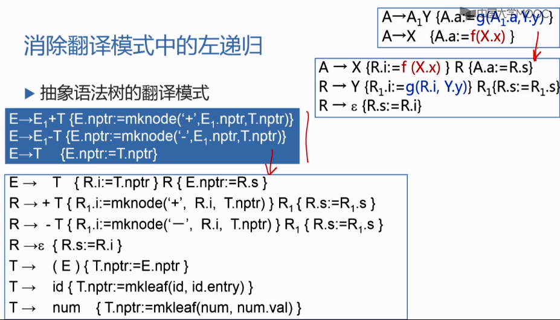

## 属性文法

**综合属性和继承属性**:  
用继承属性来表示程序设计语言结构中的上下文依赖关系很方便。  

**属性计算方法**:  
依赖图：  

树遍历:  

一遍扫描： 
要求语法分析方法和属性文法类型要对应。  

## S属性文法  
仅使用综合属性的文法称为S属性文法。S属性文法适合一遍扫描的由下至上语法分析方法，在对非终结符进行归约时进行属性计算。

## L属性文法
L属性文法适合一遍扫描的由上至下分析。  

## 语法制导翻译  
由源程序的语法结构所驱动的处理方法就是语法制导翻译法。

**翻译模式**:  

翻译模式示例:  

**统一语义动作执行时机**:  
翻译模式中有些语义动作在产生式推导过程中执行，有些语义动作在产生式推导完成后执行，语义动作不同的执行时机给语法分析器的设计带来了困难。经过转换把所有语义动作放在产生式的末尾可统一执行时机。  

**消除翻译模式中的左递归**:  

**递归下降翻译器实现设计**:  

# 中间语言

后缀式:  

有向无环图:  

三地址码:  

三元式不利于代码优化，衍生出间接三元式，既方便优化又节省空间，优化时仅调整间接码表。。  

## 常见语句到三地址码的翻译模式
