对于文法G(S)的非终结符$A \rightarrow \alpha_1|\alpha_2|...|\alpha_n$，定义：  
$FIRST(A) = \{a|\alpha_i \mathop{\Rightarrow}\limits^{\ast} a..., a \in V_T\}$  
$FOLLOW(A) = \{a|S\mathop{\Rightarrow}\limits^{\ast}...Aa..., a \in V_T\}$

## 由上至下分析
从文法的开始符号出发，反复使用各种产生式，寻找“匹配”的推导，自顶向下分析也可以看作是从开始符号出发，寻找输入串的最左推导过程。自顶向下语法分析的关键问题是对于非终结符$A \rightarrow \alpha_1|\alpha_2|...|\alpha_n$，应该选择哪个产生式。

推导：根据文法的产生式规则，把串中出现的产生式左部符号替换成右部符号。

分析方法：递归下降分析法，预测分析法

### 递归下降分析法
分析程序由一组子程序组成，对于每个语法单位（非终结符）构造一个相应的子程序，识别对应的语法单位，通过子程序间的相互调用实现对输入串的识别。  
void A(){  
    $\quad$选择一个A的产生式$A \rightarrow X_1X_2...X_n$  
    $\quad$for(i=1 to k){  
        $\qquad$if($X_i$是一个非终结符)调用过程$X_i$;  
        $\qquad$else if($X_i$等于当前输入符号a)读入下一个输入符号;  
        $\qquad$else 不匹配当前候选式，尝试下一个  
    $\quad$}  
}

递归下降分析存在以下问题：
- **文法左递归**

直接左递归消除：  
$P \rightarrow P\alpha_1|P\alpha_2|...|P\alpha_m|\beta_1|\beta_2|...|\beta_n$  
变换为：  
$P \rightarrow \beta_1P'|\beta_2P'|...|\beta_nP$  
$P' \rightarrow \alpha_1P'|\alpha_2P'|...|\alpha_m P'|\varepsilon$

间接左递归消除：  
1. 把文法G的所有非终结符按任意一种顺序排列$P_1,P_2,...,P_n;$
2. FOR i=1 TO n DO  
$\quad$ FOR j=1 TO i-1 DO  
            $\qquad$ 把形如$P_i \rightarrow P_j \gamma$的规则改写成$P_i \rightarrow \alpha_1 \gamma|\alpha_2 \gamma|...|\alpha_k \gamma;$(其中$P_j \rightarrow \alpha_1|\alpha_2|...|\alpha_k$是关于$P_j$的所有规则)  
$\quad$ 消除关于$P_i$规则的直接左递归
3. 化简由2所得的文法，去除从开始符号出发永远无法到达的非终结符的产生规则。

- **候选式匹配回溯**

对于文法G(S)中的任何非终结符$A\rightarrow\alpha_1|...|\alpha_n$，修改文法使其满足以下条件以消除回溯。
1. 消除左递归
2. 提取左公共因子使得$FIRST(\alpha_i) \cap FIRST(\alpha_j) = \phi (i \ne j)$。
3. 检查是否满足$FIRST(A) \cap FOLLOW(A) = \phi|\{\varepsilon\}$。

### LL(1)文法
满足以下条件的文法既为LL(1)文法：
1. 文法不含左递归
2. 文法中的每个非终结符A的各个产生式的候选首符集两两不相交。既，若$A \rightarrow \alpha_1|\alpha_2|...|\alpha_n$则$FIRST(\alpha_i) \cap FIRST(\alpha_j) = \phi (i \ne j)$。
3. 对文法中的每个非终结符A，若它的候选首符集包含$\varepsilon$,则需满足$FIRST(A) \cap FOLLOW(A) = \phi|\{\varepsilon\}$。

LL(1)文法不是二义的。

### 预测分析法
对于输入符号a和LL(1)文法中的语法单位$A \rightarrow \alpha_1|\alpha_2|...|\alpha_n$，若$a \in FIRST(\alpha_i)$则选择$\alpha_i$候选式，若$a \not \in FIRST(A)$且$\varepsilon \in FIRST(A)$,则选择$\varepsilon$候选式，否则a的出现属于语法错误。

**构建文法G的预测分析表M**:  
1. 对于$FIRST(\alpha)$中的每个终结符号a，将$A \rightarrow \alpha$加入到$M[A,a]$中。
2. 如果$\varepsilon$在$FIRST(\alpha)$中，那么对于$FOLLOW(A)$中的每个终结符号b，将$A \rightarrow \alpha$加入到$M[A,b]$中，如果$\varepsilon$在$FIRST(\alpha)$中，且#(结束符)也在$FOLLOW(A)$中，也将$A \rightarrow \alpha$加入到$M[A,$]$中。
3. 将M中没有产生式的位置设置为error。

如果文法G是左递归或二义的，那么M至少含有一个多重定义入口。一个文法的预测分析表M不含多重定义入口，当且仅当该文法为LL(1)的。

**预测分析算法**:  
输入：串$\omega$，文法G(S)的预测分析表M  
输出：如果$\omega$在L(G)中，输出$\omega$的一个最左推导；否则给一个错误提示  
过程：  
stack.push(#S)  
ip = 当前符号a的地址  
X = stack[top];  
while(X != #){  
    $\quad$if(X == a){stack.pop(),ip++;}  
    $\quad$else if(X == 除a以外的终结符号)error();  
    $\quad$else if(M[X,a] == error)error();  
    $\quad$else if(M[X,a] == $X \rightarrow Y_1Y_2...Y_k$){  
        $\qquad$stack.pop();  
        $\qquad$stack.push($Y_kY_{k-1}...Y_1$)
    }  
    $\quad$X = stack[top];  
};

### 扩充的巴科斯范式
在巴科斯范式元语言符号"$\rightarrow,::=,|$"的基础上扩充几个元语言符号:  
* 用花括号$\{\alpha\}$表示闭包运算$\alpha^*$
* 用$\{\alpha\}_0^n$表示可任意重复0至n次
* 用方括号$[\alpha]$表示$\{\alpha\}_0^1$，既表示$\alpha$的出现可有可无（等价于$\alpha|\varepsilon$）

对于巴科斯范式文法G(E):  
$E \rightarrow T|E+T$  
$T \rightarrow F|T*F$  
$F \rightarrow i|(E)$  
可以使用扩充的巴科斯范式表示成:  
$E \rightarrow T \{+T\}$  
$T \rightarrow F \{*F\}$  
$F \rightarrow i|(E)$  

使用扩充的巴科斯范式描述语法，便于表示左递归的消除和公因子的提取，以及程序实现。

## 由下至上分析
从输入串开始，逐步进行规约，直到文法的开始符号。自顶向下语法分析的关键问题是寻找可规约串。

规约：根据文法的产生式规则，把其中出现的产生式的右部替换为左部符号。

分析方法：算符优先分析法、LR分析法

### 算符优先分析法
按照算符的优先关系和结合性质进行语法分析，适合用来分析表达式。对于算符优先分析，可以使用最左素短语定理来确定可规约串。pratt parser算法就是一个算符优先分析法。

**算符文法**:  
对于文法G(S)，如果它的任一产生式都不包含...QR...形式的右部，则称该文法为**算符文法**。

**算符优先文法**:  
对于不含$\varepsilon$产生式的算符文法G(S)的任何一对终结符a,b，我们说：  
1. $a \doteq b$，当且仅当文法G中含有形如$P \rightarrow ...ab...|...aQb...$的产生式;
2. $a \lessdot b$，当且仅当G中含有形如$P \rightarrow ...aR...$的产生式，且$R \mathop{\Rightarrow}\limits^+ b...|Qb...$;
3. $a \gtrdot b$，当且仅当G中含有形如$P \rightarrow ...Rb...$的产生式，且$R \mathop{\Rightarrow}\limits^+ ...a|...aQ$;

如果一个算符文法G中的任何终结符对(a,b)至多只满足$a \doteq b, a \lessdot b, a \gtrdot b$三者之一，则称G是一个**算符优先文法**。

**构造算符优先关系表**:  
对于算符优先文法G(S)，定义：  

$FIRSTVT(P) = \{a | P \mathop{\Rightarrow}\limits^+ a...|Qa..., a \in V_T, Q \in V_N\}$  
$LASTVT(P) = \{a | P \mathop{\Rightarrow}\limits^+ ...a|...aQ, a \in V_T, Q \in V_N\}$

根据FIRSTVT和LASTVT集合，检查每个产生式的候选式，确定满足关系$\lessdot,\gtrdot$的所有终结符对:  
假设有个产生式有一个形为...aP...的候选式，那么，对于任何$b \in FIRSTVT(P)$，有$a \lessdot b$。  
假设有个产生式有一个形为...Pb...的候选式，那么，对于任何$a \in LASTVT(P)$，有$a \gtrdot b$。  
根据以上信息，创建算符优先关系表M[a,b]。

**短语和直接短语**:  
假设$\alpha \beta \delta$是文法G(S)的一个句型，如果有$S \mathop{\Rightarrow}\limits^* \alpha A \delta$且$A \mathop{\Rightarrow}\limits^+ \beta$,则称$\beta$是句型$\alpha \beta \delta$相对于非终结符A的**短语**。  
如果有$A \rightarrow \beta$，则称$\beta$是句型$\alpha \beta \delta$相对于规则$A \rightarrow \beta$的**直接短语**。

**素短语和最左素短语**:  
对于文法G(S)的一个短语，若它至少包含一个终结符，且除它自身外不再包含任何更小的素短语，则称这个短语为**素短语**。  
**最左素短语**指处于句型最左边的那个素短语。

**最左素短语定理**:  
对于算符优先文法句型(括在两个#之间)的一般形式：  
#$N_1a_1N_2a_2...a_{j-1}N_ja_j...N_ia_iN_{i+1}a_{i+1}...N_na_nN_{n+1}$#  
其中，$a_i$都是终结符，$N_i$是可选的非终结符。  
定理：一个算符优先文法G的任何句型的最左素短语是满足如下条件的最左子串$N_ja_j...N_ia_iN_{i+1}$:  
1. $a_{j-1} \lessdot a_j$ ($a_j$优先级大于左侧)
2. $a_j \doteq a_{j+1},...,a_{i-1} \doteq a_i$ (子串内部优先级相同)
3. $a_i \gtrdot a_{i+1}$ ($a_i$优先级大于右侧)

**算符优先分析算法**:  
输入：串$a_1...a_ja_{j+1}...a_ia_{i+1}...$#，算符优先关系表M  
输出：一个分析树，不一定是语法树，因为跳过了$A \rightarrow B$形式的规约  
算法：  
stack[top] = #;  
do{  
    $\quad$a=next_token();  
    $\quad$if(stack[k]$\in V_T$)j=stack.top;  
    $\quad$else j=stack.top-1;  
    $\quad$while(stack[j]$\gtrdot$a){  
        $\qquad$//寻找最左素短语  
        $\qquad$do{  
            $\quad\qquad$Q = stack[j];  
            $\quad\qquad$if(stack[j-1]$\in V_T$)j = j-1;  
            $\quad\qquad$else j = j-2;  
        $\qquad$}until(stack[j] $\lessdot$ Q);  
        $\qquad$//把stack[j+1]...stack[top]规约为某个非终结符N,从左到右，终结符对相同终结符，非终结符对非终结符（可以不同）  
        $\qquad$stack.pop(stack[j+1]...stack[top]);    
        $\qquad$stack.push(N);  
    $\quad$}  
    $\quad$if(stack[j] $\lessdot$ a || stack[j] $\doteq$ a)stack.push(a);  
    $\quad$else error();  
}until(a==#);

### LR分析法
LR分析法是一个**规范规约**过程，使用**句柄**作为其可规约串。规范规约的关键问题是寻找句柄。

**句柄**: 一个句型的最左直接短语称为该句型的**句柄**。

**规范规约**:   
假设$\alpha$是文法G(S)的一个句子，则满足下列条件的句型序列$\alpha_n,\alpha_{n-1},...,\alpha_0$是$\alpha$的一个规范规约:  
1. $\alpha_n = \alpha$
2. $\alpha_0 = S$
3. 对于任何i(0<i<=n)，$\alpha_{i-1}$是从$\alpha_i$经把句柄替换成相应产生式的左部符号而得到的

**规范句型**:  
规范规约是最左规约，规范规约的逆过程就是最右推导，最右推导也称**规范推导**，由规范推导推出的句型称为**规范句型**。

**LR文法**:  
对于一个文法，如果能够构造一张LR分析表，使得它的每个表项都是唯一确定的，则这个文法称为LR文法。  
对于一个LR文法，如果能够用一个每步最多向前检查k个符号的LR分析器分析，则这个文法称为LR(k)文法。  

LR文法不是二义的，二义文法肯定不是LR文法。LR文法是无二义文法的真子集(既:LR文法$\subset$无二义文法)。

**LR分析表**:  
**ACTION[S,a]**: 当状态S面临输入符号a时，应采取什么动作（移进或规约）。  
**GOTO[S,X]**: 状态S面对非终结符号X时，下一状态是什么。

**LR分析过程**:  
LR分析使用状态栈存储分析状态$S_0S_1...S_m$，使用分析栈存储分析过程#$X_1...X_m$，输入串为$a_1...a_n$#

对于格局($S_0S_1...S_m$,#$X_1...X_m$,$a_ia_{i+1}...a_n$#)  
LR分析器根据$ACTION(S_M,a_i)$确定下一步动作：  
1. 若$ACTION(S_m,a_i)$为移进，且S为下一状态，则格局变为：($S_0S_1...S_mS$,#$X_1...X_ma_i$,$a_{i+1}...a_n$#)
2. 若$ACTION(S_m,a_i)$为按$A \rightarrow \beta$规约，则格局变为：($S_0S_1...S_{m-r}S$,#$X_1...X_{m-r}A$,$a_ia_{i+1}...a_n$#)，此处$S = GOTO(S_{m-r},A)$，r=length($\beta$)，$\beta = X_{m-r+1}...X_m$
3. 若$ACTION(S_m,a_i)$为“接受”，则格局变化过程终止，分析成功

#### LR(0)分析法
**活前缀**:  
指**规范句型**的一个前缀，这种前缀不含句柄之后的任何符号。既，对于规范句型$\alpha\beta\delta$，$\beta$为句柄，如果$\alpha\beta=u_1u_2...u_r$，则符号串$u_1u_2...u_i(1<=i<=r)$是$\alpha\beta\delta$的活前缀。($\delta$必为终结符串)。  
在LR分析过程中的任何时候，分析栈中的文法符号应该构成活前缀。规范规约过程中，LR分析表保证分析栈中总是活前缀，就说明分析采取的移进/规约动作是正确的。  
对于一个文法G，可以构造一个DFA识别G的所有活前缀。  
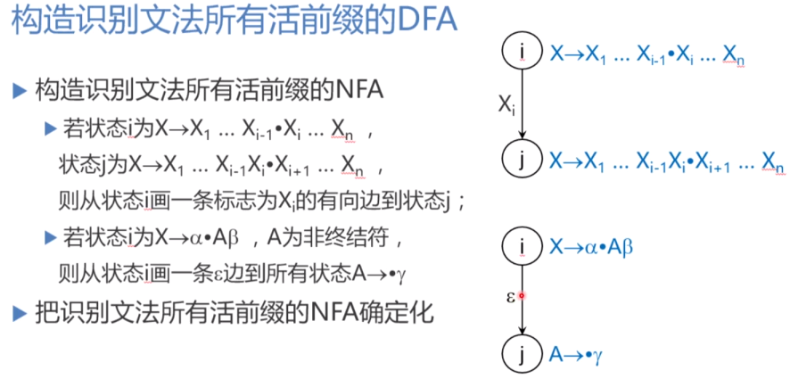

**拓广文法**:  
构造文法G'，它包含了整个G，并引进不出现在G中的非终结符号S'，以及产生式$S' \rightarrow S$，S'是G'的开始符号，则称G'是G的拓广文法。  
拓广文法的目的是保证文法的开始符号只有一个产生式，且开始符号不会出现在其他产生式的右部。这样就保证了G'只有唯一的"接受"状态，既，仅含项目$S' \rightarrow S \bullet$的状态。

**LR(0)项目**:  
在每个产生式的右部添加一个圆点，表示在分析过程中已经看到的产生式的部分，例如$A \rightarrow XYZ$有四个项目"$A \rightarrow \bullet XYZ,A \rightarrow X \bullet YZ,A \rightarrow XY \bullet Z,A \rightarrow XYZ \bullet$"  

$A \rightarrow \alpha \bullet$称为"规约项目";  
规约项目$S' \rightarrow \alpha \bullet$称为"接受项目";  
$A \rightarrow \alpha \bullet a \beta (a \in V_T)$称为"移进项目";  
$A \rightarrow \alpha \bullet B \beta (B \in V_N)$称为"待约项目";  

**有效项目**:  
项目$A \rightarrow \beta_1 \bullet \beta_2$对活前缀$\alpha \beta_1$是有效的，其条件是存在规范推导$S' \mathop{\Rightarrow_R}\limits^* \alpha A \beta \Rightarrow_R \alpha \beta_1 \beta_2 \omega$  
在任何分析栈中的活前缀$X_1X_2...X_m$的有效项目集正是从识别活前缀的DFA的初态出发，读出$X_1X_2...X_m$后到达的那个项目集（状态）。

有效项目具有如下性质：若项目$A \rightarrow \alpha \bullet B \beta$对活前缀$\delta \alpha$是有效的且$B \rightarrow \gamma$是一个产生式，则项目$B \rightarrow \bullet \gamma$对$\delta \alpha$也是有效的。

**LR(0)项目集规范族的构造**：  
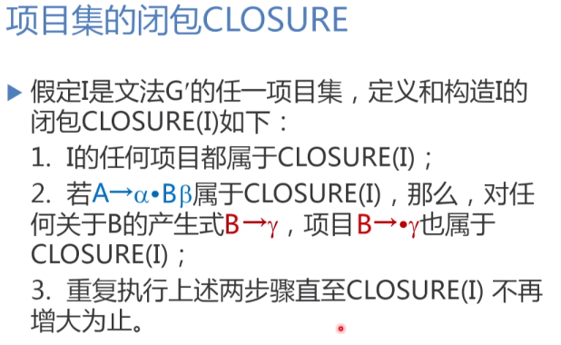
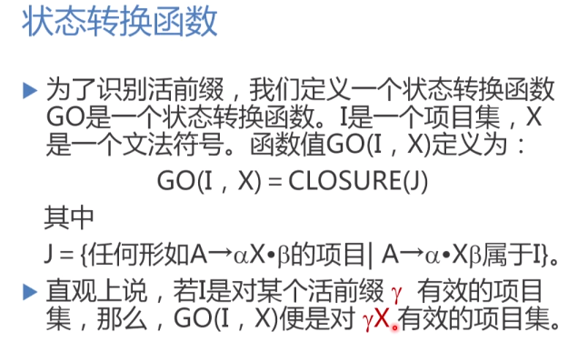
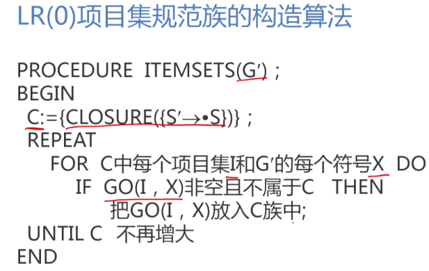

**LR(0)文法**:  
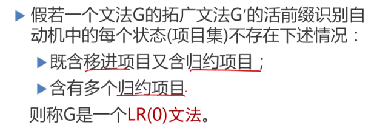

**LR(0)分析表的构造**:  
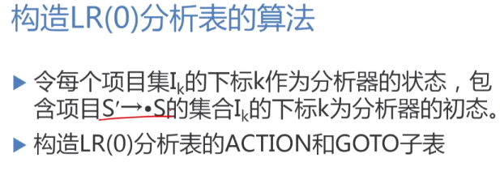
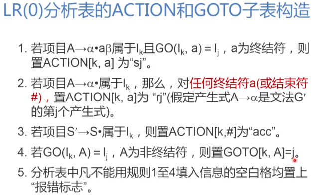
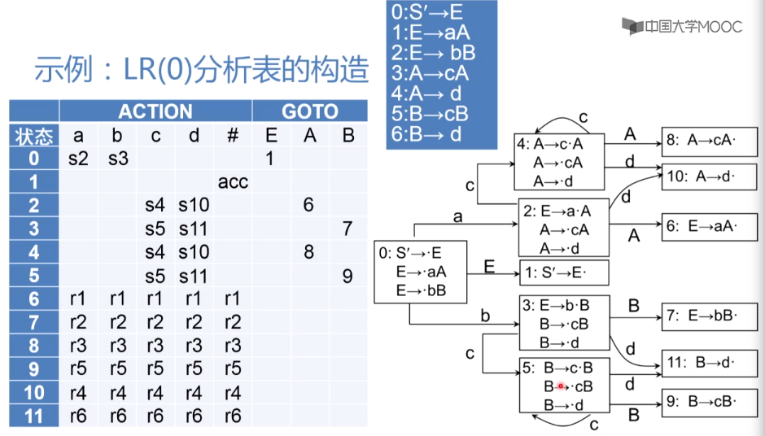

#### SLR(1)分析法
**非LR(0)文法的项目集冲突**:  
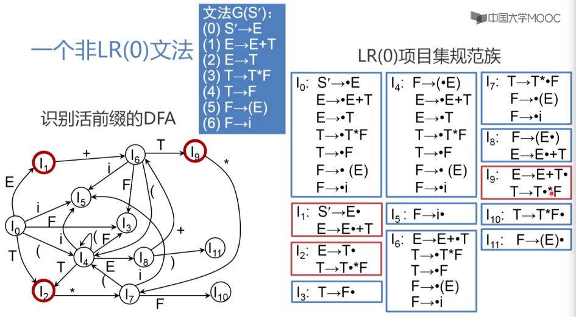
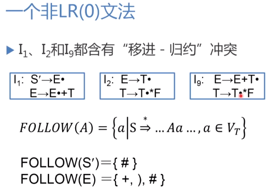

**SLR(1)冲突解决方法**:  
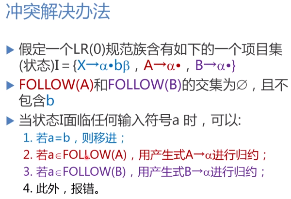
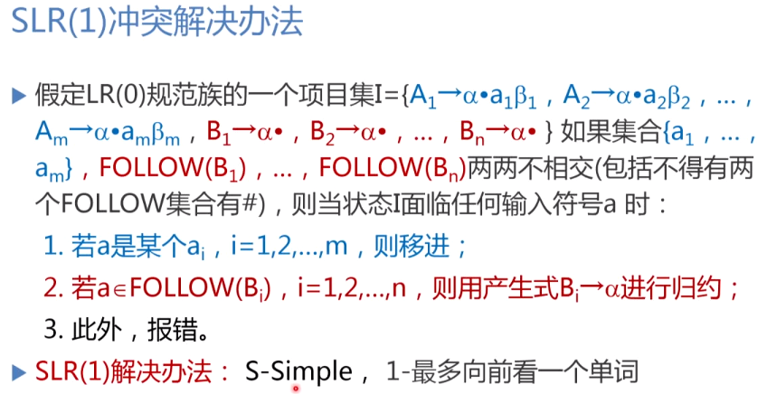

**构造SLR(1)分析表的方法**:  
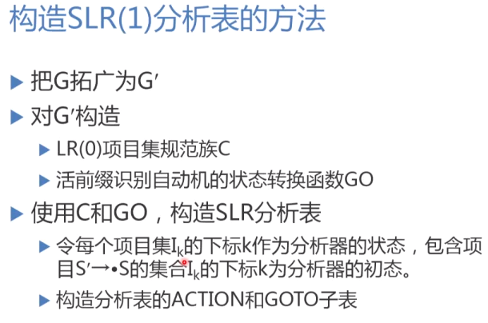
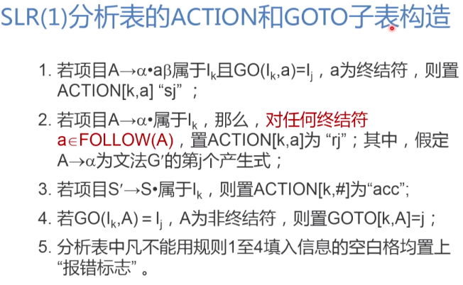
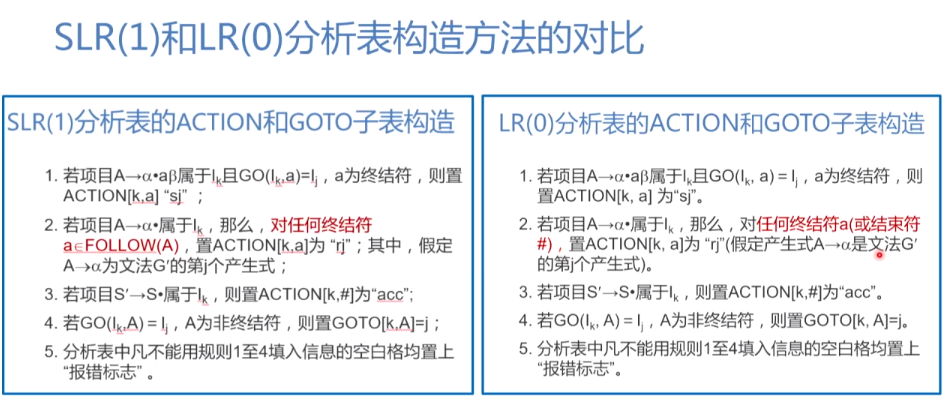
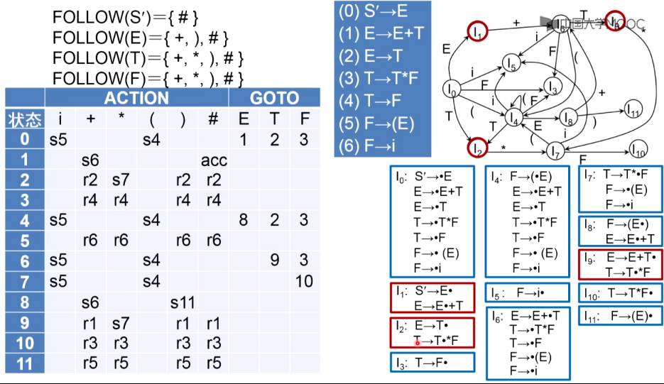

**SLR(1)文法**:  
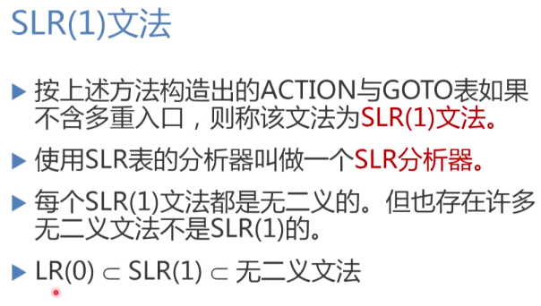

#### LR(1)分析法
**SLR(1)冲突消解存在的问题**:  
对于一个非SLR(1)文法，SLR(1)归约可能使得分析栈中出现一个非活前缀(此前缀不是规范句型的前缀)，出现此情况的原因是FOLLOW集合提供的信息太泛，不能体现当前活前缀或分析状态对拟归约生成的非终结符A后面的符号的具体约束，而是泛泛的接受所有可能出现在A后面的单词，这是由FOLLOW集合的定义决定的，因此需要更加精细的预测信息，要能够根据当前栈中的活前缀和状态组成的格局来选择下一个能够接受的单词。  
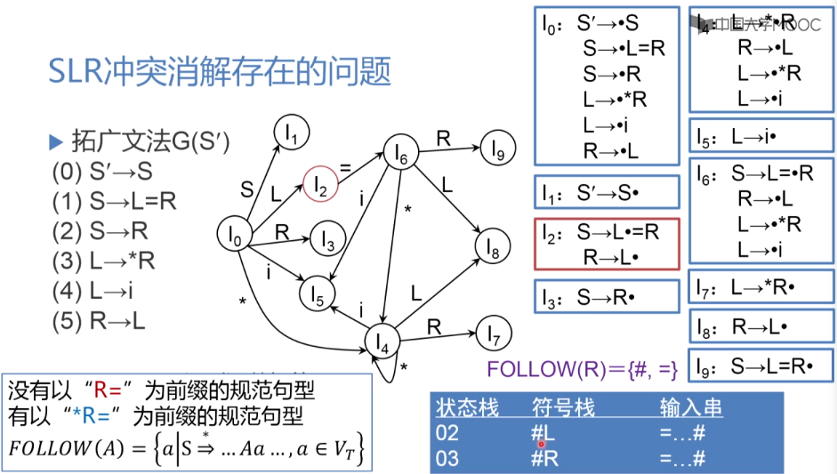
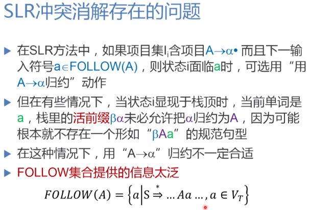

**LR(k)项目**:  
通常取k<=1的情形，向前展望1个符号即可确定移进还是归约，k值过大会使分析表状态爆炸。  
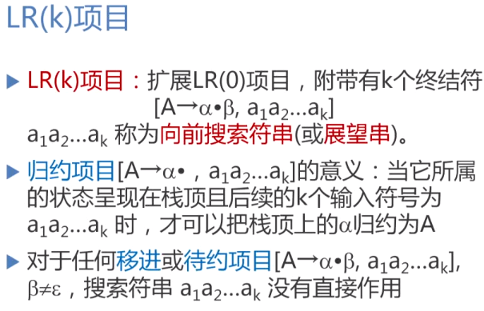  
移进或待约项目的搜索符号串会间接传递给归约项目。

**LR(1)有效项目**:  
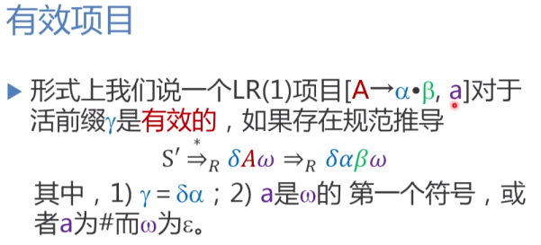
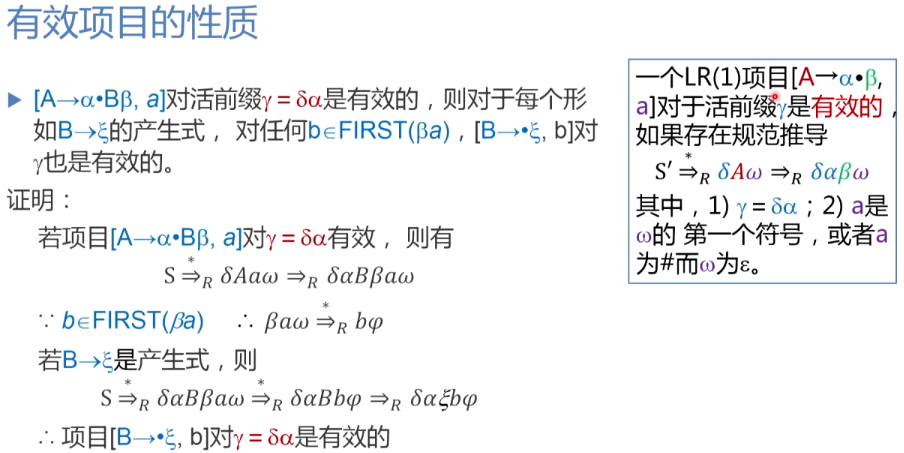

**LR(1)分析表的构造**:  
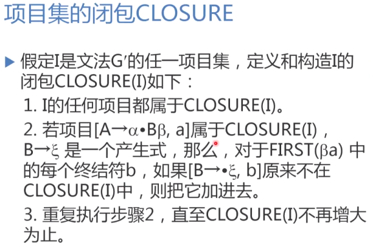
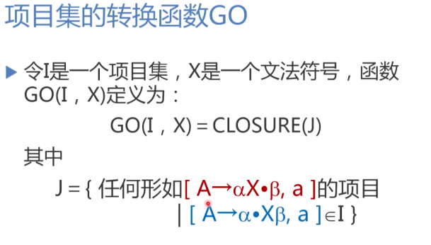
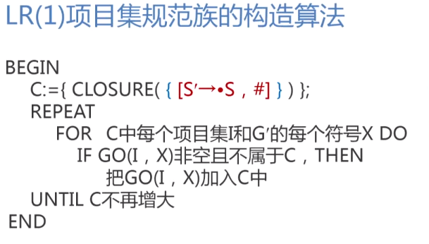
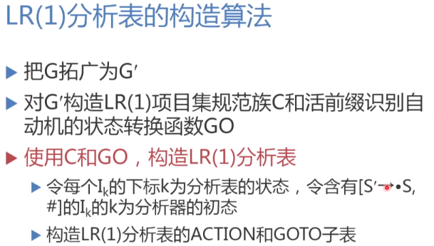
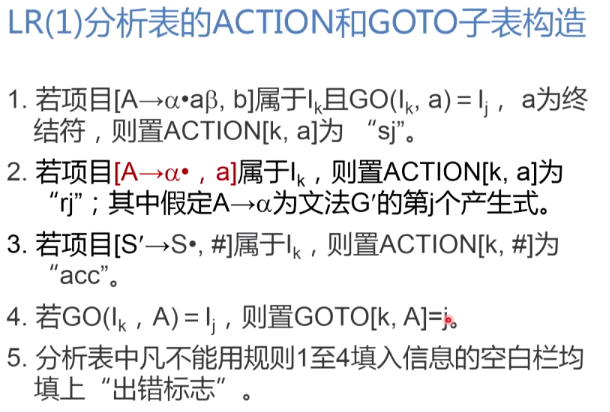
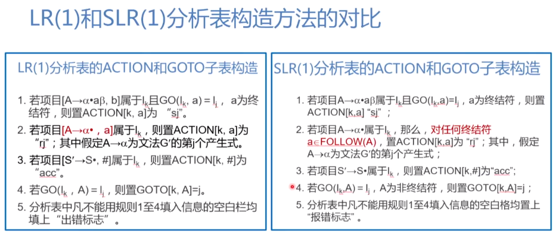
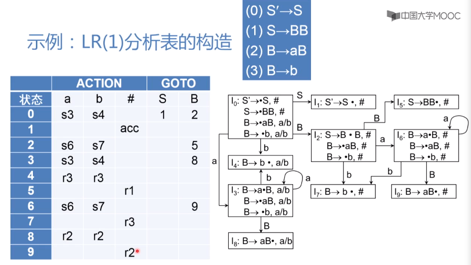

**LR(1)文法**:  
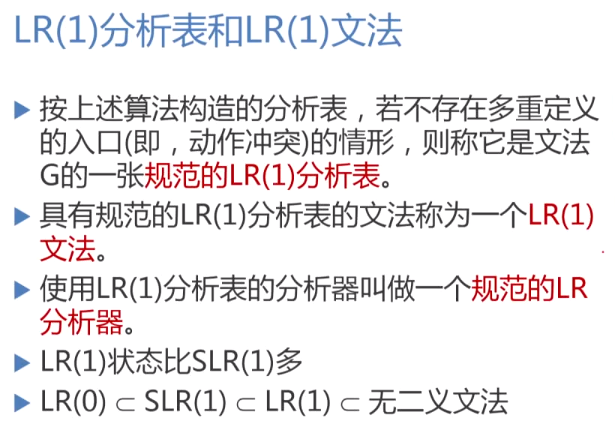

